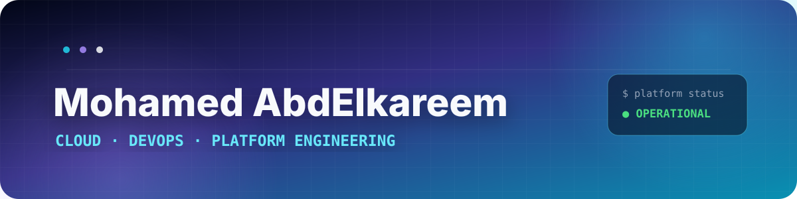

<!-- =========================================================
     MOHAMED ABDELKAREEM — GITHUB PROFILE
     Visual direction: Cloud / Platform / Neon Dark
========================================================== -->

  

  

 

 

mohamed@platform:~$ ./profile --status

role        = "Cloud & DevOps Engineer"
focus       = ["Kubernetes", "Infrastructure as Code", "GitOps", "Observability"]
philosophy  = "Automate the repeatable. Observe the critical. Document the dangerous."
currently   = "Building production-style cloud platforms and deployment systems"

⚡ Engineering Identity

<table>
<tr>
<td width="50%" valign="top">

☁️ Cloud Infrastructure

I build reproducible infrastructure with a strong focus on networking, security boundaries, scalability, and operational clarity.

AWS · Terraform · Linux · Bash · Python

</td>
<td width="50%" valign="top">

⚙️ Container Platforms

I package and operate distributed workloads using declarative configuration and repeatable deployment patterns.

Docker · Kubernetes · Helm · Traefik

</td>
</tr>
<tr>
<td width="50%" valign="top">

🔁 Delivery & GitOps

I design delivery flows that turn source changes into traceable, versioned, and recoverable deployments.

GitHub Actions · Jenkins · Argo CD · Git

</td>
<td width="50%" valign="top">

📡 Observability

I treat metrics, dashboards, alerts, and failure visibility as platform features—not decorations added after deployment.

Prometheus · Grafana · Alertmanager

</td>
</tr>
</table>

🧬 Platform DNA

Cloud & Infrastructure

Containers, Delivery & GitOps

Applications, Data & Tooling

  

🚀 Featured Engineering Work

International Commerce Platform

A cloud-native commerce platform built to demonstrate the full path from application source code to automated infrastructure, container delivery, GitOps deployment, and observability.

 

<table>
<tr>
<td align="center"><b>&lt; 12 min</b> Infrastructure provisioning</td>
<td align="center"><b>&lt; 4 min</b> Automated deployment cycle</td>
<td align="center"><b>~60%</b> Docker image reduction</td>
<td align="center"><b>GitOps</b> Versioned Kubernetes delivery</td>
</tr>
</table>

Platform stack

<b>Open platform architecture</b>

flowchart LR
    DEV[Developer] --> GIT[GitHub Repository]
    GIT --> CI[GitHub Actions]
    CI --> REG[Container Registry]

    TF[Terraform] --> AWS[AWS Infrastructure]
    AWS --> K8S[Kubernetes Platform]

    GIT --> ARGO[Argo CD]
    ARGO --> HELM[Helm Releases]
    HELM --> K8S
    REG --> K8S

    K8S --> APP[Spring Boot Microservices]
    APP --> PG[(PostgreSQL)]
    APP --> REDIS[(Redis)]

    APP --> PROM[Prometheus]
    PROM --> GRAF[Grafana]
    PROM --> ALERT[Alertmanager]

What this project proves

Infrastructure can be recreated instead of repaired manually.

Application delivery can be versioned, automated, and observed.

Kubernetes manifests are treated as release artifacts.

Monitoring and alerting are included in the platform design.

Backend knowledge is used to operate applications more intelligently.

🛰️ What I Am Building Toward

Platform Engineering
├── Secure cloud foundations
├── Reusable Terraform modules
├── Kubernetes platform operations
├── Helm-based application packaging
├── GitOps delivery with Argo CD
├── Production-grade observability
├── Deployment runbooks and incident readiness
└── Cost, reliability, and security improvements

📊 GitHub Signal

  

🐍 Contribution Flow

<picture>
  <source media="(prefers-color-scheme: dark)" srcset="https://raw.githubusercontent.com/Mohamed3bkreem404/Mohamed3bkreem404/output/github-contribution-grid-snake-dark.svg">
  <source media="(prefers-color-scheme: light)" srcset="https://raw.githubusercontent.com/Mohamed3bkreem404/Mohamed3bkreem404/output/github-contribution-grid-snake.svg">
  
</picture>

🤝 Let’s Build Reliable Systems

I am interested in DevOps, Cloud, Platform Engineering, and Infrastructure Automation opportunities.

 

